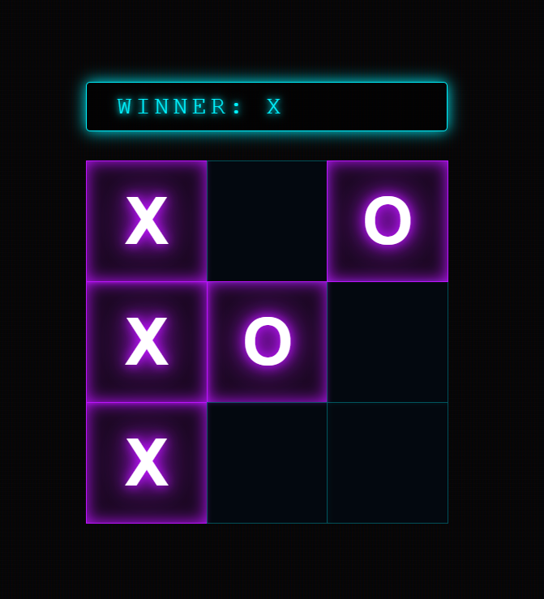

# Tic-Tac-Toe

<div align="center">

[](https://react.dev)
[](https://vite.dev)
[](https://developer.mozilla.org/en-US/docs/Web/JavaScript)
[](LICENSE)
[]()

A modern, interactive Tic-Tac-Toe game built with **React 19** and **Vite**. Experience smooth gameplay with real-time winner detection and responsive UI.

[Live Demo](#) • [Features](#features) • [Installation](#installation) • [Usage](#usage) • [Contributing](#contributing)

</div>

---

## 📋 Table of Contents

- [About](#about)
- [Features](#features)
- [Screenshots & Live Demo](#screenshots--live-demo)
- [Tech Stack](#tech-stack)
- [Prerequisites](#prerequisites)
- [Installation](#installation)
- [Usage](#usage)
- [Project Structure](#project-structure)
- [Available Scripts](#available-scripts)
- [Game Rules](#game-rules)
- [Architecture](#architecture)
- [Code Examples](#code-examples)
- [Performance](#performance)
- [Browser Support](#browser-support)
- [Contributing](#contributing)
- [License](#license)

---

## 🎯 About

This is a fully functional Tic-Tac-Toe game implementation showcasing modern React development practices. The application features real-time game state management, winner detection, and an intuitive user interface. Perfect for learning React fundamentals or as a foundation for more advanced game development.

---

## ✨ Features

- ⚡ **Lightning Fast**: Built with Vite for instant hot module replacement (HMR) and optimized production builds
- 🎮 **Interactive Gameplay**: Smooth, responsive game board with real-time updates
- 🏆 **Winner Detection**: Automatic detection of winning patterns across rows, columns, and diagonals
- 👥 **Turn-based System**: Alternating turns between Player X and Player O with clear status indicator
- 🎨 **Modern UI**: Clean, professional design with CSS styling
- ♻️ **State Management**: Efficient React hooks (useState) for game state handling
- 🔍 **ESLint Configured**: Code quality checks with ESLint and React-specific rules
- 📱 **Responsive Design**: Works seamlessly across different screen sizes

---

## 🎬 Screenshots & Live Demo

### 🌐 Live Deployment

Experience the game live:

<div align="center">

[](https://netlify.com)

**[🔗 Play Game Live](https://tic-tac-toe-exceptional.netlify.app/)**

</div>

### 📸 Game Screenshots

#### Gameplay Screenshot


### Quick Start from Live Demo
1. Visit the [Live Demo Link](https://tic-tac-toe-exceptional.netlify.app/)
2. Click on any empty square to make a move
3. Alternate between X and O players
4. Win by getting 3 in a row (horizontal, vertical, or diagonal)
5. Refresh the page to start a new game

---

## 🛠️ Tech Stack

| Technology | Version | Purpose |
|-----------|---------|---------|
| React | 19.2.0 | UI library and state management |
| React DOM | 19.2.0 | React rendering engine |
| Vite | 7.2.4 | Build tool and dev server |
| JavaScript | ES6+ | Programming language |
| ESLint | 9.39.1 | Code quality and style |
| CSS3 | - | Styling and animations |

### Development Tools
- `@vitejs/plugin-react` (5.1.1) - Official React plugin for Vite
- `@types/react` (19.2.5) - TypeScript definitions for React
- `@types/react-dom` (19.2.3) - TypeScript definitions for React DOM
- `eslint-plugin-react-hooks` (7.0.1) - React Hooks linting rules
- `eslint-plugin-react-refresh` (0.4.24) - Fast Refresh support

---

## 📦 Prerequisites

Before you begin, ensure you have the following installed on your system:

- **Node.js** (v18 or higher) - [Download](https://nodejs.org/)
- **npm** (v9 or higher) or **yarn** (v3 or higher)
- **Git** (optional, for version control)

To verify installations:
```bash
node --version    # v18.0.0 or higher
npm --version     # v9.0.0 or higher
git --version     # (optional)
```

---

## 🚀 Installation

### 1. Clone the Repository

```bash
git clone https://github.com/yourusername/tic-tac-toe.git
cd tic-tac-toe
```

### 2. Install Dependencies

```bash
npm install
# or
yarn install
```

This will install all required dependencies listed in `package.json`.

### 3. Verify Installation

```bash
npm run lint
```

---

## 💻 Usage

### Development Server

Start the development server with hot module replacement:

```bash
npm run dev
```

The application will be available at `http://localhost:5173` (or the next available port).

**Features during development:**
- Hot Module Replacement (HMR) - Changes reflect instantly without page reload
- Source maps for easier debugging
- Detailed error messages

### Build for Production

Create an optimized production build:

```bash
npm build
```

The compiled files will be in the `dist/` directory.

### Preview Production Build

Test the production build locally:

```bash
npm run preview
```

### Code Quality

Run ESLint to check for code quality issues:

```bash
npm run lint
```

---

## 📂 Project Structure

```
tic-tac-toe/
├── src/
│   ├── App.jsx              # Main React component (Board, Square, Game Logic)
│   ├── App.css              # Application styling
│   ├── main.jsx             # Entry point
│   ├── index.css            # Global styles
│   └── assets/              # Images and static assets
├── public/                  # Static files (favicons, robots.txt, etc.)
├── index.html               # HTML template
├── package.json             # Project metadata and dependencies
├── vite.config.js           # Vite configuration
├── eslint.config.js         # ESLint configuration
├── README.md                # This file
└── .gitignore               # Git ignore rules

```

### Key Files Explained

- **src/App.jsx**: Core application logic containing:
  - `Square` component: Individual game cells
  - `Board` component: Game board layout and state management
  - `calculateWinner()`: Winner detection algorithm

- **src/App.css**: Game styling (board layout, squares, status)
- **src/main.jsx**: React DOM rendering setup
- **vite.config.js**: Build and development server configuration

---

## 📋 Available Scripts

```bash
# Start development server with HMR
npm run dev

# Build optimized production bundle
npm run build

# Run ESLint code quality checks
npm run lint

# Preview production build locally
npm run preview
```

---

## 🎮 Game Rules

1. **Players**: Two players alternately place their marks (X and O)
2. **Winning**: First player to get three marks in a row (horizontal, vertical, or diagonal) wins
3. **Draw**: If the board fills without a winner, the game is a draw
4. **Valid Moves**: Players cannot place marks on already occupied squares

### Winning Patterns
- ✓ Horizontal: [0,1,2], [3,4,5], [6,7,8]
- ✓ Vertical: [0,3,6], [1,4,7], [2,5,8]
- ✓ Diagonal: [0,4,8], [2,4,6]

---

## 🏗️ Architecture

### Component Hierarchy

```
Board (Main Component)
├── Status Display (Winner/Next Player)
├── Game Row 1
│   ├── Square (0)
│   ├── Square (1)
│   └── Square (2)
├── Game Row 2
│   ├── Square (3)
│   ├── Square (4)
│   └── Square (5)
└── Game Row 3
    ├── Square (6)
    ├── Square (7)
    └── Square (8)
```

### State Management

The application uses React's `useState` hook for:
- **squares**: Array of 9 elements representing board state
- **xIsNext**: Boolean indicating whose turn it is

### Game Flow

1. Player clicks a square
2. `handleClick()` validates the move
3. Update squares array with current player's mark
4. Toggle player turn
5. `calculateWinner()` checks for winning condition
6. Display status (winner or next player)
7. Repeat until win or draw

---

## 💡 Code Examples

### Basic Game Loop

```jsx
// Handle player move
function handleClick(i) {
  // Prevent move if square occupied or game won
  if (squares[i] || calculateWinner(squares)) {
    return;
  }
  
  // Update board state
  const nextSquares = squares.slice();
  nextSquares[i] = xIsNext ? "X" : "O";
  
  // Update game state
  setSquares(nextSquares);
  setXIsNext(!xIsNext);
}
```

### Winner Detection Algorithm

```jsx
function calculateWinner(squares) {
  const lines = [
    [0, 1, 2], [3, 4, 5], [6, 7, 8], // rows
    [0, 3, 6], [1, 4, 7], [2, 5, 8], // columns
    [0, 4, 8], [2, 4, 6]              // diagonals
  ];

  for (let i = 0; i < lines.length; i++) {
    const [a, b, c] = lines[i];
    if (squares[a] && squares[a] === squares[b] && squares[a] === squares[c]) {
      return squares[a];
    }
  }
  return null;
}
```

### Square Component

```jsx
function Square({ value, onSquareClick }) {
  return (
    <button className="square" onClick={onSquareClick}>
      {value}
    </button>
  );
}
```

---

## ⚡ Performance

- **Build Size**: Optimized with Vite tree-shaking (~30KB gzipped)
- **Load Time**: < 1 second on modern connections
- **Runtime**: O(1) winner detection, efficient state updates
- **Memory**: Minimal footprint with 9 elements array

**Optimization Techniques:**
- Code splitting with Vite
- CSS minification
- JS minification and compression
- Fast Refresh during development
- Lazy loading support

---

## 🌐 Browser Support

| Browser | Version | Status |
|---------|---------|--------|
| Chrome | Latest | ✅ Fully Supported |
| Firefox | Latest | ✅ Fully Supported |
| Safari | Latest | ✅ Fully Supported |
| Edge | Latest | ✅ Fully Supported |
| IE 11 | - | ❌ Not Supported |

---

## 🤝 Contributing

Contributions are welcome! Here's how to get started:

### 1. Fork the Repository
```bash
# Click "Fork" button on GitHub
```

### 2. Create a Feature Branch
```bash
git checkout -b feature/amazing-feature
```

### 3. Make Your Changes
```bash
# Make your improvements
npm run lint  # Ensure code quality
```

### 4. Commit Your Changes
```bash
git commit -m "Add amazing feature"
```

### 5. Push to Branch
```bash
git push origin feature/amazing-feature
```

### 6. Open a Pull Request
- Provide clear description of changes
- Reference any related issues
- Ensure all tests pass

### Enhancement Ideas
- 🎯 Add game history/undo functionality
- 🎨 Implement different themes
- 📊 Add game statistics
- 🤖 Add AI opponent (difficulty levels)
- 📱 Improve mobile responsiveness
- 🔊 Add sound effects
- ⏱️ Add game timer
- 🌙 Dark/Light mode toggle

---

## 📄 License

This project is licensed under the **MIT License** - see the [LICENSE](LICENSE) file for details.

MIT License allows you to:
- ✅ Use commercially
- ✅ Modify the code
- ✅ Distribute copies
- ✅ Include license notice

---

## 📞 Support & Contact

- 📧 Email: akshhatsri7843@gmail.com
- 🐛 Issues: [GitHub Issues](https://github.com/exceptional007/tic-tac-toe/issues)
- 💬 Discussions: [GitHub Discussions](https://github.com/exceptional007/tic-tac-toe/discussions)

---

## 🙏 Acknowledgments

- [React Documentation](https://react.dev)
- [Vite Documentation](https://vite.dev)
- [React Hooks Guide](https://react.dev/reference/react)
- Community feedback and contributions

---

## 📈 Roadmap

### v1.1.0 (Upcoming)
- [ ] Game reset button
- [ ] Move history and time travel
- [ ] Game statistics tracking
- [ ] Improved UI animations

### v2.0.0 (Future)
- [ ] Multiplayer online support
- [ ] AI opponent with difficulty levels
- [ ] User authentication
- [ ] Leaderboard system
- [ ] Mobile app version

---

<div align="center">

**[⬆ back to top](#tic-tac-toe)**

Made with ❤️ by [Akshhat Srivastava](https://github.com/exceptional007)

</div>
